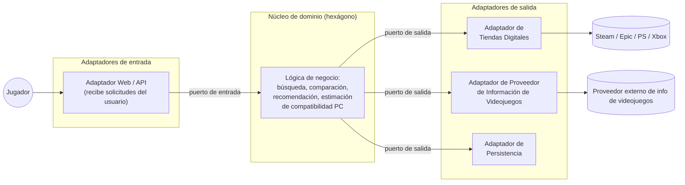
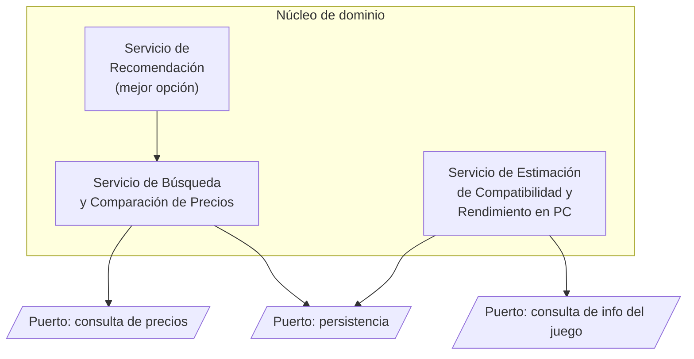
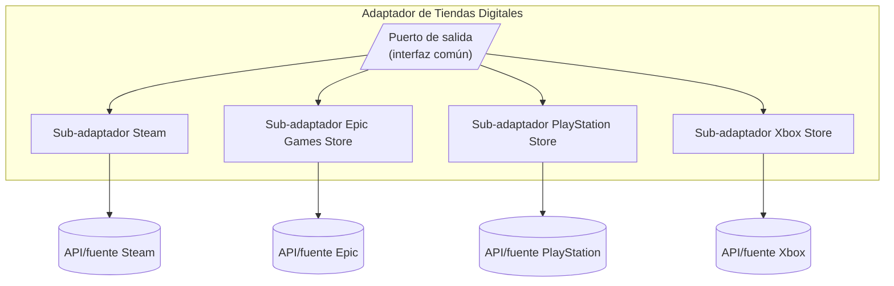

# 5. Vista de bloques de construcción

Esta sección presenta la descomposición estática de DRIFT en bloques de construcción y sus dependencias, siguiendo el modelo de **Arquitectura Hexagonal** definido en la Sección 4.

## 5.1 Caja blanca — Sistema global (Nivel 1)

### Diagrama de contexto interno

### Motivación de la descomposición

La descomposición sigue directamente la decisión de Arquitectura Hexagonal (Sección 4): el **núcleo de dominio** concentra la lógica de negocio y no depende de ninguna tecnología ni fuente externa concreta. Toda comunicación con el exterior —usuario, tiendas digitales, proveedor de información, almacenamiento— pasa por **adaptadores** que implementan **puertos** definidos por el núcleo.

Esta separación responde al objetivo de calidad prioritario (mantenibilidad, Sección 1.2) y a las restricciones de dependencia de fuentes externas heterogéneas (Sección 2.3).

### Bloques de construcción (cajas negras)

| Nombre | Responsabilidad |
|---|---|
| **Adaptador Web/API (entrada)** | Recibe las solicitudes del jugador (búsqueda, comparación, consulta de compatibilidad) y las traduce a llamadas sobre el puerto de entrada del núcleo. |
| **Núcleo de dominio** | Contiene la lógica de comparación de precios, identificación de la mejor opción, recomendación y estimación de compatibilidad/rendimiento en PC. No conoce las tecnologías concretas usadas por los adaptadores. |
| **Adaptador de Tiendas Digitales (salida)** | Traduce el puerto de salida del núcleo a las APIs/mecanismos concretos de cada tienda digital (Steam, Epic, PlayStation Store, Xbox Store). Aísla las diferencias de formato entre tiendas. |
| **Adaptador de Proveedor de Información de Videojuegos (salida)** | Obtiene características y requisitos de los videojuegos desde el proveedor externo y los traduce al modelo del núcleo. |
| **Adaptador de Persistencia (salida)** | Almacena y recupera la información necesaria para el sistema (histórico de precios, especificaciones de dispositivo registradas por el usuario, etc.), sin exponer al núcleo la tecnología de base de datos usada. |

### Interfaces importantes

| Puerto | Dirección | Descripción |
|---|---|---|
| Puerto de búsqueda/comparación | Entrada | Expuesto por el núcleo, invocado por el Adaptador Web/API. |
| Puerto de estimación de compatibilidad PC | Entrada | Expuesto por el núcleo, invocado por el Adaptador Web/API. |
| Puerto de consulta de precios/disponibilidad | Salida | Definido por el núcleo, implementado por el Adaptador de Tiendas Digitales. |
| Puerto de consulta de información de videojuego | Salida | Definido por el núcleo, implementado por el Adaptador de Proveedor de Información. |
| Puerto de persistencia | Salida | Definido por el núcleo, implementado por el Adaptador de Persistencia. |

---

## 5.2 Nivel 2

Se detallan únicamente los bloques más relevantes o volátiles: el **Núcleo de dominio** y el **Adaptador de Tiendas Digitales**, por concentrar la lógica principal y la mayor variabilidad externa, respectivamente. El Adaptador Web/API, el Adaptador de Proveedor de Información y el Adaptador de Persistencia se consideran suficientemente simples en este nivel de avance del proyecto y no se refinan aún.

### 5.2.1 Caja blanca — Núcleo de dominio

| Nombre | Responsabilidad |
|---|---|
| **Servicio de Búsqueda y Comparación de Precios** | Consulta precios y disponibilidad a través del puerto de salida correspondiente y compara las opciones entre tiendas. |
| **Servicio de Recomendación** | A partir de la comparación, identifica la opción de compra más conveniente para el usuario. |
| **Servicio de Estimación de Compatibilidad y Rendimiento en PC** | Compara las especificaciones del dispositivo del usuario con los requisitos del videojuego obtenidos por el puerto de información, y estima si el juego es compatible o cuál será su rendimiento aproximado. |

**Objetivos de calidad soportados:** mantenibilidad y testabilidad — cada servicio depende únicamente de los puertos (interfaces), no de las implementaciones concretas de los adaptadores, lo que permite sustituirlos por dobles de prueba.

### 5.2.2 Caja blanca — Adaptador de Tiendas Digitales

| Nombre | Responsabilidad |
|---|---|
| **Sub-adaptador Steam / Epic / PlayStation / Xbox** | Cada uno traduce el formato y el mecanismo de acceso específico de su tienda al modelo común esperado por el puerto de salida del núcleo. El fallo de un sub-adaptador no debe afectar a los demás (Sección 2.4/2.3 — disponibilidad ante fallo de fuente externa). |

**Objetivos de calidad soportados:** mantenibilidad (agregar una nueva tienda implica añadir un sub-adaptador nuevo, sin modificar el núcleo) y disponibilidad (aislamiento de fallos por tienda).
