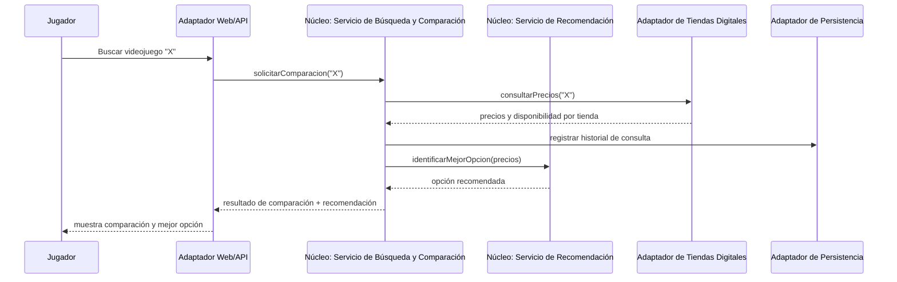
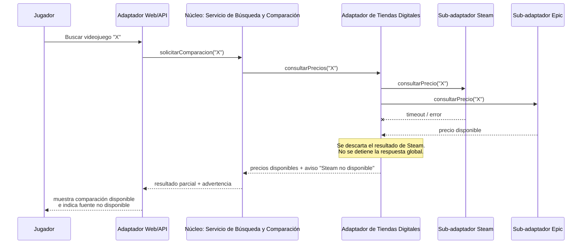
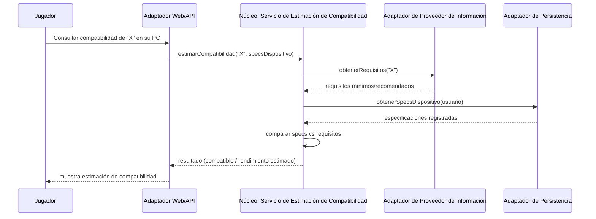

# 6. Vista de tiempo de ejecución

Esta sección documenta cómo interactúan en tiempo de ejecución los bloques de construcción definidos en la Sección 5. Siguiendo el criterio de arc42 (relevancia arquitectónica, no exhaustividad), se seleccionan **3 escenarios representativos**: el flujo principal del sistema, un caso de manejo de fallo (disponibilidad) y un caso de estimación de compatibilidad. Los nombres de los bloques usados en los diagramas son consistentes con la Sección 5.

## 6.1 Escenario: Búsqueda y comparación de precios

Corresponde al escenario de calidad de rendimiento documentado en `docs/Escenarios.md` (búsqueda y comparación, ≤ 3 s p95).

**Explicación:**

1. El jugador busca un videojuego desde el Adaptador Web/API.
2. El Adaptador Web/API invoca el puerto de entrada del Servicio de Búsqueda y Comparación.
3. El Servicio de Búsqueda consulta precios y disponibilidad a través del Adaptador de Tiendas Digitales.
4. El Adaptador de Tiendas Digitales devuelve los precios obtenidos de cada tienda.
5. El Servicio de Búsqueda registra la consulta en el Adaptador de Persistencia (historial de precios).
6. El Servicio de Búsqueda delega en el Servicio de Recomendación la identificación de la mejor opción.
7. El Servicio de Recomendación devuelve la opción recomendada.
8. El resultado (comparación + recomendación) se devuelve al jugador a través del Adaptador Web/API.

El Servicio de Búsqueda delega en el Adaptador de Tiendas Digitales sin conocer cuántas ni cuáles tiendas se consultan (mantenibilidad); la respuesta depende del tiempo de las tiendas más lentas, lo que motiva el límite de 3 s p95 y el manejo de fallos del escenario 6.2.

---

## 6.2 Escenario: Fallo de una fuente externa de precios

Corresponde al escenario de disponibilidad documentado en `docs/Escenarios.md` (respuesta ante fallo de fuente externa, ≤ 5 s).

**Explicación:**

1. El jugador busca un videojuego desde el Adaptador Web/API, igual que en el escenario 6.1.
2. El Servicio de Búsqueda solicita precios al Adaptador de Tiendas Digitales.
3. El Adaptador de Tiendas Digitales reparte la consulta entre los sub-adaptadores correspondientes (Steam, Epic, etc.).
4. El sub-adaptador Steam falla (timeout o error de la fuente externa).
5. El sub-adaptador Epic responde correctamente.
6. El Adaptador de Tiendas Digitales descarta el resultado fallido sin detener la respuesta global.
7. El resultado se entrega con los precios disponibles y un aviso indicando qué fuente no respondió.
8. El jugador recibe la comparación posible junto con la advertencia.

Este comportamiento materializa en tiempo de ejecución la restricción 2.3/2.4 (disponibilidad ante fallo de fuente externa) y la decisión arquitectónica de aislamiento de dependencias externas (Sección 4).

---

## 6.3 Escenario: Estimación de compatibilidad y rendimiento en PC

Corresponde al escenario de calidad documentado en `docs/Escenarios.md` (estimación de compatibilidad/rendimiento, ≤ 5 s p95).

**Explicación:**

1. El jugador solicita la compatibilidad de un videojuego para su PC.
2. El Adaptador Web/API invoca el puerto de entrada del Servicio de Estimación de Compatibilidad.
3. El servicio solicita los requisitos del videojuego al Adaptador de Proveedor de Información.
4. El adaptador devuelve los requisitos mínimos/recomendados.
5. El servicio solicita las especificaciones del dispositivo registradas por el usuario al Adaptador de Persistencia.
6. El adaptador devuelve las especificaciones almacenadas.
7. El servicio compara especificaciones contra requisitos.
8. El resultado (compatible / rendimiento estimado) se devuelve al jugador.

El Servicio de Estimación de Compatibilidad depende únicamente de los puertos de información y persistencia, no de la implementación concreta del proveedor externo, lo que permite sustituir la fuente de datos sin afectar la lógica de comparación (mantenibilidad, ver Sección 5.2.1).
