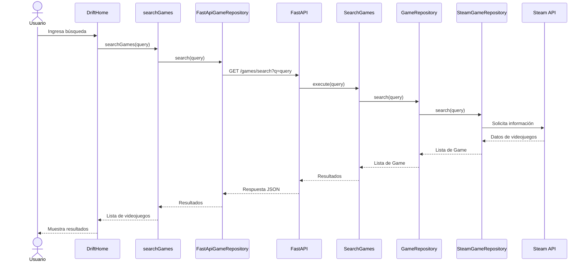

# 8. Conceptos transversales

En esta sección se presentan los conceptos que se aplican de forma transversal en la arquitectura de DRIFT y que permiten mantener una estructura organizada y fácil de modificar. Estos conceptos se relacionan principalmente con la separación de responsabilidades, el uso de puertos y adaptadores y la comunicación entre frontend, backend y la API externa de Steam.

## 8.1 Separación de responsabilidades

DRIFT organiza sus componentes de acuerdo con la responsabilidad que cumplen dentro del sistema. En el backend se separan el dominio, los casos de uso y la infraestructura, mientras que en el frontend se separan el dominio, la lógica de aplicación, la infraestructura de comunicación y la interfaz de usuario.

Esta separación permite modificar una parte del sistema sin tener que realizar cambios innecesarios en las demás. 

Las principales áreas son:

* **Dominio:** contiene el modelo `Game` y el puerto `GameRepository`.
* **Aplicación:** contiene el caso de uso `SearchGames`.
* **Infraestructura:** contiene las implementaciones para acceder a fuentes externas, como `SteamGameRepository`.
* **Frontend:** contiene la interfaz y los componentes necesarios para realizar y mostrar las búsquedas.

## 8.2 Puertos y adaptadores

DRIFT utiliza el enfoque de puertos y adaptadores para reducir el acoplamiento entre la lógica de negocio y las tecnologías externas.

En el backend, `GameRepository` define el puerto que establece cómo se pueden realizar búsquedas de videojuegos. El caso de uso `SearchGames` trabaja con este puerto sin depender directamente de Steam.

La implementación `SteamGameRepository` actúa como adaptador y permite conectar el puerto con la API de Steam.

De esta forma, la lógica de aplicación puede mantenerse independiente de la fuente concreta de información.

## 8.3 Modelo de dominio

El concepto principal del dominio es `Game`, que representa un videojuego dentro de DRIFT.

En el backend, el modelo se encuentra en:

```text
backend/app/domain/model/game.py
```

y contiene los datos básicos utilizados por el sistema:

* `id`
* `name`
* `prices`

En el frontend existe una representación equivalente mediante:

```text
frontend/domain/model/Game.js
```

Esta representación permite trabajar con los datos recibidos desde el backend dentro de la aplicación frontend. No constituye una segunda fuente de verdad, sino una representación utilizada por la interfaz.

## 8.4 Integración con Steam

Steam es una fuente externa de información para DRIFT. La integración se realiza mediante `SteamGameRepository`, ubicado en:

```text
backend/app/infrastructure/external/steam/steam_game_repository.py
```

Este componente se encarga de comunicarse con Steam y transformar la información obtenida al modelo `Game` utilizado por DRIFT.

Esto evita que los detalles propios de la API externa se propaguen hacia el dominio y los casos de uso.

## 8.5 Comunicación entre frontend y backend

El frontend y el backend se comunican mediante una API REST.

La búsqueda se realiza mediante el endpoint:

```text
GET /games/search?q=<consulta>
```

El flujo comienza cuando el usuario realiza una búsqueda desde `DriftHome`. La solicitud pasa por `searchGames.js` y `FastApiGameRepository`, que se encarga de comunicarse con la API de FastAPI.

En el backend, la solicitud llega a `main.py`, donde se ejecuta el caso de uso `SearchGames`. Posteriormente, este utiliza `GameRepository` y su implementación `SteamGameRepository` para obtener los resultados.

## 8.6 Flujo de búsqueda

El flujo principal de búsqueda se puede representar de la siguiente manera:



## 8.7 Relación con la mantenibilidad

Los conceptos anteriores contribuyen al atributo de calidad de **mantenibilidad**, definido como una prioridad para DRIFT.

La separación de responsabilidades permite localizar los cambios en partes específicas del sistema. El uso de puertos y adaptadores permite modificar una implementación externa sin cambiar directamente los casos de uso. Por ejemplo, `SearchGames` puede continuar trabajando con `GameRepository` aunque cambie la implementación utilizada para obtener los videojuegos.

De esta manera, la arquitectura busca reducir el acoplamiento y facilitar la evolución del sistema.

