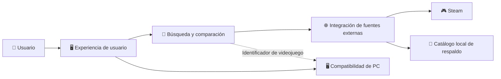
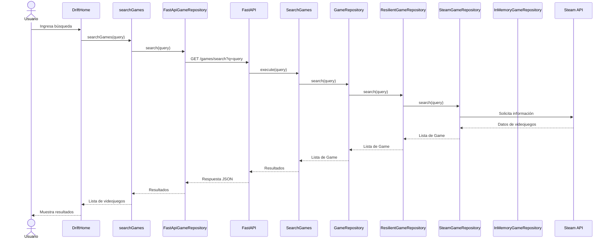

# 8. Conceptos transversales

En esta sección se presentan los conceptos que se aplican de forma transversal en la arquitectura de DRIFT y que permiten mantener una estructura organizada, fácil de modificar y con responsabilidades claramente delimitadas.

Estos conceptos se relacionan principalmente con la separación de responsabilidades, el lenguaje ubicuo, los contextos delimitados, la propiedad de los datos, el uso de puertos y adaptadores y la comunicación entre frontend, backend y las fuentes externas.

## 8.1 Lenguaje ubicuo

Para mantener una comprensión común entre los diferentes componentes del sistema, DRIFT utiliza los siguientes conceptos:

- **Videojuego:** elemento principal consultado por el usuario y representado mediante el modelo `Game`.
- **Búsqueda:** operación mediante la cual el usuario consulta videojuegos.
- **Precio:** información asociada a un videojuego proveniente de una fuente externa.
- **Fuente externa:** servicio externo que proporciona información para DRIFT, como Steam.
- **Fuente no disponible:** situación en la que una fuente externa no puede proporcionar información.
- **Catálogo de respaldo:** fuente local utilizada cuando la fuente principal no está disponible.
- **Compatibilidad:** evaluación de si el hardware del usuario cumple con los requisitos de un videojuego.
- **Requisito mínimo:** especificación mínima de hardware necesaria para ejecutar un videojuego.
- **Requisito recomendado:** especificación de hardware recomendada para ejecutar un videojuego.
- **Nivel de GPU:** valor utilizado por DRIFT para comparar la capacidad gráfica del equipo del usuario con los requisitos del videojuego.

## 8.2 Contextos delimitados

A partir del crecimiento funcional de DRIFT se identifican tres contextos delimitados de dominio y soporte:

- **Búsqueda y comparación:** responsable de la consulta y representación de la información de videojuegos utilizada por el usuario.
- **Integración de fuentes externas:** responsable de obtener información desde fuentes externas y gestionar la fuente de respaldo cuando una fuente principal no está disponible.
- **Compatibilidad de PC:** responsable de consultar los requisitos de un videojuego y estimar su compatibilidad con el hardware del usuario.

La **Experiencia de usuario** actúa como cliente de estos contextos y presenta sus resultados al usuario.

La separación de estos contextos permite mantener responsabilidades específicas sin modificar directamente los datos pertenecientes a otro contexto.

## 8.3 Context map

La relación entre los contextos y sus principales dependencias se representa de la siguiente manera:



Las relaciones principales son:

- La Experiencia de usuario consume las capacidades de Búsqueda y comparación y Compatibilidad de PC.
- Búsqueda y comparación utiliza Integración de fuentes externas para obtener información de videojuegos.
- Integración de fuentes externas se comunica con Steam y con el catálogo local de respaldo.
- Búsqueda y comparación proporciona el identificador del videojuego utilizado por Compatibilidad de PC.

## 8.4 Propiedad de los datos

Cada contexto mantiene la responsabilidad sobre los datos que le corresponden:


| Dato                          | Contexto responsable             |
|-------------------------------|----------------------------------|
| Game                          | Búsqueda y comparación         |
| Precios provenientes de Steam | Integración de fuentes externas |
| Catálogo local de respaldo   | Integración de fuentes externas |
| Datos de caché de Steam      | Integración de fuentes externas |
| GameRequirements              | Compatibilidad de PC             |
| Resultado de compatibilidad   | Compatibilidad de PC             |


La propiedad de los datos busca evitar que un contexto modifique directamente información administrada por otro contexto.

## 8.5 Separación de responsabilidades

DRIFT organiza sus componentes de acuerdo con la responsabilidad que cumplen dentro del sistema.

En el backend, la Arquitectura Hexagonal separa el dominio, los casos de uso y los adaptadores de infraestructura. En el frontend se separan la interfaz, la lógica de aplicación y la comunicación con el backend.

Las principales responsabilidades del backend son:

- **Dominio:** contiene modelos como `Game` y `GameRequirements`, además de los puertos `GameRepository` y `GameRequirementsRepository`.
- **Aplicación:** contiene los casos de uso `SearchGames` y `EstimateCompatibility`.
- **Infraestructura:** contiene adaptadores como `SteamGameRepository`, `InMemoryGameRepository`, `ResilientGameRepository` e `InMemoryGameRequirementsRepository`.
- **Entrada:** `main.py` expone la API REST utilizada por el frontend.

Esta separación permite localizar los cambios en componentes específicos y reducir el acoplamiento entre responsabilidades.

## 8.6 Puertos y adaptadores

DRIFT utiliza el enfoque de Puertos y Adaptadores (Arquitectura Hexagonal) para reducir el acoplamiento entre la lógica de negocio y las tecnologías externas.

En el contexto de búsqueda, `GameRepository` define el puerto mediante el cual `SearchGames` solicita videojuegos sin depender directamente de una fuente concreta.

`SteamGameRepository` implementa este puerto para comunicarse con Steam, mientras que `InMemoryGameRepository` proporciona una fuente local de respaldo.

`ResilientGameRepository` coordina ambas fuentes y permite utilizar el catálogo de respaldo cuando la fuente principal no está disponible.

Para la compatibilidad de PC, `GameRequirementsRepository` define el puerto utilizado por `EstimateCompatibility`, cuya implementación actual es `InMemoryGameRequirementsRepository`.

De esta forma, los casos de uso permanecen desacoplados de las implementaciones concretas.

## 8.7 Modelo de dominio

El concepto principal del contexto de Búsqueda y comparación es `Game`, que representa un videojuego dentro de DRIFT.

En el backend, el modelo se encuentra en:

```
backend/app/domain/model/game.py
```

y contiene los datos básicos utilizados por el sistema:

- `id`
- `name`
- `prices`

El contexto de Compatibilidad de PC utiliza `GameRequirements` para representar los requisitos mínimos y recomendados de un videojuego.

En el frontend existe una representación de `Game` mediante:

```
frontend/domain/model/Game.js
```

Esta representación permite trabajar con los datos recibidos desde el backend dentro de la aplicación frontend. No constituye una segunda fuente de verdad, sino una representación utilizada por la interfaz.

## 8.8 Integración con fuentes externas

Steam es una fuente externa de información para DRIFT. La integración se realiza mediante `SteamGameRepository`, ubicado en:

```
backend/app/infrastructure/external/steam/steam_game_repository.py
```

Este componente se encarga de comunicarse con Steam y transformar la información obtenida al modelo `Game` utilizado por DRIFT.

Cuando la fuente principal no está disponible, `ResilientGameRepository` utiliza `InMemoryGameRepository` como fuente de respaldo.

Esta responsabilidad se mantiene aislada del caso de uso `SearchGames`, evitando que los detalles de las fuentes externas se propaguen hacia la lógica de aplicación.

## 8.9 Comunicación entre frontend y backend

El frontend y el backend se comunican mediante una API REST.

La búsqueda se realiza mediante el endpoint:

```
GET /games/search?q=<consulta>
```

El flujo comienza cuando el usuario realiza una búsqueda desde `DriftHome`. La solicitud pasa por `searchGames.js` y `FastApiGameRepository`, que se encarga de comunicarse con la API de FastAPI.

En el backend, la solicitud llega a `main.py`, donde se ejecuta el caso de uso `SearchGames`. Posteriormente, este utiliza `GameRepository` y la implementación correspondiente para obtener los resultados.

La funcionalidad de compatibilidad utiliza el mismo canal de comunicación entre frontend y backend, ejecutando el caso de uso `EstimateCompatibility`.

## 8.10 Flujo de búsqueda

El flujo principal de búsqueda se puede representar de la siguiente manera:



## 8.11 Relación con la mantenibilidad

Los conceptos anteriores contribuyen al atributo de calidad de mantenibilidad, definido como una prioridad para DRIFT.

La separación de responsabilidades permite localizar los cambios en partes específicas del sistema. Los contextos delimitados permiten establecer responsabilidades claras sobre los datos. El uso de puertos y adaptadores permite modificar una implementación externa sin cambiar directamente los casos de uso.

Por ejemplo, `SearchGames` puede continuar trabajando con `GameRepository` aunque cambie la implementación utilizada para obtener los videojuegos.

De esta manera, la arquitectura busca reducir el acoplamiento, evitar responsabilidades cruzadas y facilitar la evolución del sistema.

 
