# C4 — Diagrama de Componentes de DRIFT

El diagrama de nivel 3 muestra con mayor detalle la estructura interna de DRIFT y la comunicación entre los componentes que participan en la búsqueda de videojuegos. Se representan los componentes que actualmente existen en el repositorio, sin agregar componentes o funcionalidades que no estén implementados.

```mermaid
flowchart LR

    %% =====================================================
    %% ACTORES Y SISTEMAS EXTERNOS
    %% =====================================================

    USER["👤 Usuario / Jugador<br/><br/>Busca videojuegos,<br/>consulta precios y compatibilidad"]

    STEAM["🎮 Steam API<br/><br/>Servicio externo que proporciona<br/>información y precios de videojuegos"]

    PLAYSTATION["🎮 PlayStation API<br/><br/>Fuente externa del catálogo<br/>de videojuegos de PlayStation"]


    %% =====================================================
    %% FRONTEND
    %% =====================================================

    subgraph FRONTEND["🟦 DRIFT — Frontend Web"]

        subgraph UI["🖥️ Capa de Interfaz"]

            PAGE["📄 page.js<br/><br/>Punto de entrada de la<br/>aplicación web"]

            HOME["🎨 DriftHome<br/><br/>Interfaz principal de DRIFT<br/>para realizar búsquedas y<br/>consultar compatibilidad"]

        end


        subgraph FRONT_APP["⚙️ Capa de Aplicación"]

            FRONT_SEARCH["🔎 searchGames.js<br/><br/>Caso de uso del frontend<br/>para buscar videojuegos"]

            FRONT_PORT["🔗 GameSearchPort.js<br/><br/>Puerto utilizado para<br/>realizar la búsqueda"]

        end


        subgraph FRONT_INFRA["🌐 Capa de Infraestructura"]

            HTTP["🌐 FastApiGameRepository.js<br/><br/>Adaptador HTTP que implementa<br/>GameSearchPort y consume<br/>la API REST del backend"]

            COMPAT_HTTP["🌐 FastApiCompatibilityRepository.js<br/><br/>Adaptador HTTP utilizado para<br/>consultar la compatibilidad"]

        end

    end


    %% =====================================================
    %% BACKEND
    %% =====================================================

    subgraph BACKEND["🟪 DRIFT — Backend / API"]

        subgraph API_LAYER["🔌 Capa de Entrada"]

            API["🔌 main.py — FastAPI<br/><br/>Expone la API REST de DRIFT<br/><br/>Recibe solicitudes HTTP y<br/>ejecuta los casos de uso"]

        end


        subgraph APPLICATION["⚙️ Capa de Aplicación"]

            SEARCH["🔎 SearchGames<br/><br/>Caso de uso de búsqueda<br/>de videojuegos<br/><br/>Utiliza GameRepository"]

            SYNC_PS["🔄 SyncPlayStationCatalog<br/><br/>Caso de uso para actualizar<br/>el catálogo de PlayStation"]

            COMPAT["🖥️ EstimateCompatibility<br/><br/>Caso de uso de compatibilidad<br/>de PC"]

        end


        subgraph DOMAIN["🧠 Capa de Dominio"]

            GAME["🎮 Game<br/><br/>Entidad del dominio<br/><br/>id<br/>name<br/>prices"]

            PORT["🔗 GameRepository<br/><br/>Puerto del dominio<br/><br/>Define search(query)"]

            CATALOG_PORT["🔗 GameCatalogSource<br/><br/>Puerto para obtener<br/>un catálogo externo"]

            NORMALIZED_GAME["📦 NormalizedGame<br/><br/>Modelo normalizado utilizado<br/>para el catálogo externo"]

            REQUIREMENTS["🧩 GameRequirements<br/><br/>Modelo del dominio para<br/>requisitos de PC"]

            REQUIREMENTS_PORT["🔗 GameRequirementsRepository<br/><br/>Puerto para consultar<br/>requisitos de PC"]

        end


        subgraph INFRASTRUCTURE["🏗️ Capa de Infraestructura"]

            STEAM_REPO["🎮 SteamGameRepository<br/><br/>Adaptador externo<br/><br/>Implementa GameRepository<br/>y consulta Steam"]

            RESILIENT_REPO["🛡️ ResilientGameRepository<br/><br/>Implementa GameRepository<br/><br/>Usa Steam como fuente principal<br/>y un catálogo local de respaldo"]

            MEMORY_REPO["💾 InMemoryGameRepository<br/><br/>Repositorio local de respaldo<br/><br/>Implementa GameRepository"]

            COMBINED_REPO["🔀 CombinedGameRepository<br/><br/>Implementa GameRepository<br/><br/>Combina los resultados del<br/>repositorio principal con<br/>el catálogo local de PlayStation"]

            PS_SOURCE["🎮 PlayStationGameCatalogSource<br/><br/>Adaptador externo<br/><br/>Implementa GameCatalogSource,<br/>consulta PlayStation y normaliza<br/>los datos del catálogo"]

            PS_CATALOG["💾 InMemoryPlayStationCatalog<br/><br/>Catálogo local de PlayStation<br/><br/>Implementa GameRepository<br/>y almacena los juegos<br/>obtenidos mediante sincronización"]

            REQUIREMENTS_REPO["💾 InMemoryGameRequirementsRepository<br/><br/>Repositorio en memoria<br/><br/>Implementa GameRequirementsRepository"]

        end

    end


    %% =====================================================
    %% PERSISTENCIA PREVISTA
    %% =====================================================

    DB["🗄️ Base de datos DRIFT<br/><br/>Persistencia prevista<br/>para una evolución futura<br/><br/>No implementada actualmente"]


    %% =====================================================
    %% FLUJO PRINCIPAL DEL FRONTEND
    %% =====================================================

    USER -->|"1. Busca un videojuego"| HOME

    PAGE -->|"2. Carga la aplicación"| HOME

    HOME -->|"3. Solicita búsqueda"| FRONT_SEARCH

    FRONT_SEARCH -->|"4. Utiliza el puerto"| FRONT_PORT

    FRONT_PORT -->|"5. Implementado por"| HTTP

    HTTP -->|"6. GET /games/search?q=..."| API


    %% =====================================================
    %% BÚSQUEDA EN EL BACKEND
    %% =====================================================

    API -->|"7. Ejecuta SearchGames"| SEARCH

    SEARCH -->|"8. Solicita búsqueda"| PORT

    PORT -.->|"9. Implementado por"| COMBINED_REPO


    %% =====================================================
    %% COMBINACIÓN DE FUENTES
    %% =====================================================

    COMBINED_REPO -->|"10. Consulta repositorio principal"| RESILIENT_REPO

    COMBINED_REPO -->|"11. Consulta catálogo PlayStation"| PS_CATALOG


    %% =====================================================
    %% RESILIENCIA DE STEAM
    %% =====================================================

    RESILIENT_REPO -->|"12. Fuente principal"| STEAM_REPO

    RESILIENT_REPO -->|"13. Respaldo ante fallo"| MEMORY_REPO


    %% =====================================================
    %% STEAM
    %% =====================================================

    STEAM_REPO -->|"14. Consulta catálogo y detalles"| STEAM

    STEAM -->|"15. Retorna datos JSON"| STEAM_REPO

    STEAM_REPO -->|"16. Construye objetos Game"| RESILIENT_REPO


    %% =====================================================
    %% PLAYSTATION EN LA BÚSQUEDA
    %% =====================================================

    PS_CATALOG -->|"17. Devuelve juegos del catálogo local"| COMBINED_REPO

    COMBINED_REPO -->|"18. Combina resultados y precios"| GAME

    GAME -->|"19. Resultados de búsqueda"| SEARCH


    %% =====================================================
    %% RETORNO DE LA BÚSQUEDA
    %% =====================================================

    SEARCH -->|"20. Retorna lista de Game"| API

    API -->|"21. Respuesta JSON"| HTTP

    HTTP -->|"22. Recibe resultados"| FRONT_SEARCH

    FRONT_SEARCH -->|"23. Devuelve juegos"| HOME

    HOME -->|"24. Muestra nombres y precios"| USER


    %% =====================================================
    %% SINCRONIZACIÓN DEL CATÁLOGO PLAYSTATION
    %% =====================================================

    API -->|"25. POST /games/sync/playstation"| SYNC_PS

    SYNC_PS -->|"26. Solicita catálogo"| CATALOG_PORT

    CATALOG_PORT -.->|"27. Implementado por"| PS_SOURCE

    PS_SOURCE -->|"28. Consulta catálogo externo"| PLAYSTATION

    PLAYSTATION -->|"29. Retorna información del catálogo"| PS_SOURCE

    PS_SOURCE -->|"30. Normaliza información"| NORMALIZED_GAME

    NORMALIZED_GAME -->|"31. Catálogo normalizado"| SYNC_PS

    SYNC_PS -->|"32. Reemplaza catálogo local"| PS_CATALOG


    %% =====================================================
    %% COMPATIBILIDAD DE PC
    %% =====================================================

    USER -->|"33. Consulta compatibilidad"| HOME

    HOME -->|"34. Solicita compatibilidad"| COMPAT_HTTP

    COMPAT_HTTP -->|"35. POST /games/{game_id}/compatibility"| API

    API -->|"36. Ejecuta EstimateCompatibility"| COMPAT

    COMPAT -->|"37. Solicita requisitos"| REQUIREMENTS_PORT

    REQUIREMENTS_PORT -.->|"38. Implementado por"| REQUIREMENTS_REPO

    REQUIREMENTS_REPO -->|"39. Obtiene requisitos"| REQUIREMENTS

    REQUIREMENTS -->|"40. Entrega requisitos"| COMPAT

    COMPAT -->|"41. Retorna resultado"| API

    API -->|"42. Respuesta JSON"| COMPAT_HTTP

    COMPAT_HTTP -->|"43. Resultado"| HOME

    HOME -->|"44. Muestra compatibilidad"| USER


    %% =====================================================
    %% PERSISTENCIA FUTURA
    %% =====================================================

    DB -.->|"Evolución futura de persistencia"| PS_CATALOG
    DB -.->|"Evolución futura de persistencia"| MEMORY_REPO


    %% =====================================================
    %% ESTILOS
    %% =====================================================

    classDef actor fill:#FFFFFF,stroke:#333333,stroke-width:2px,color:#000000

    classDef frontend fill:#E3F2FD,stroke:#1565C0,stroke-width:2px,color:#000000

    classDef backend fill:#E8EAF6,stroke:#3949AB,stroke-width:2px,color:#000000

    classDef application fill:#FFF3E0,stroke:#EF6C00,stroke-width:2px,color:#000000

    classDef domain fill:#E8EAF6,stroke:#3949AB,stroke-width:2px,color:#000000

    classDef infrastructure fill:#FFF3E0,stroke:#EF6C00,stroke-width:2px,color:#000000

    classDef external fill:#FCE4EC,stroke:#C2185B,stroke-width:2px,color:#000000

    classDef planned fill:#F5F5F5,stroke:#757575,stroke-width:2px,stroke-dasharray:5 5,color:#555555


    class USER actor

    class PAGE,HOME,FRONT_SEARCH,FRONT_PORT,HTTP,COMPAT_HTTP frontend

    class API backend

    class SEARCH,SYNC_PS,COMPAT application

    class GAME,PORT,CATALOG_PORT,NORMALIZED_GAME,REQUIREMENTS,REQUIREMENTS_PORT domain

    class STEAM_REPO,RESILIENT_REPO,MEMORY_REPO,COMBINED_REPO,PS_SOURCE,PS_CATALOG,REQUIREMENTS_REPO infrastructure

    class STEAM,PLAYSTATION external

    class DB planned


    %% =====================================================
    %% LEYENDA
    %% =====================================================

    subgraph LEGEND["📖 Leyenda"]

        LEGEND_ACTOR["Persona"]

        LEGEND_FRONTEND["Frontend"]

        LEGEND_BACKEND["Backend"]

        LEGEND_DOMAIN["Dominio"]

        LEGEND_INFRA["Infraestructura"]

        LEGEND_EXTERNAL["Servicio externo"]

        LEGEND_PLANNED["Elemento previsto / futuro"]

    end

    class LEGEND_ACTOR actor
    class LEGEND_FRONTEND frontend
    class LEGEND_BACKEND backend
    class LEGEND_DOMAIN domain
    class LEGEND_INFRA infrastructure
    class LEGEND_EXTERNAL external
    class LEGEND_PLANNED planned
```

### Componentes principales

| Capa | Componente | Responsabilidad |
|---|---|---|
| Interfaz | `page.js` | Punto de entrada de la aplicación web. |
| Interfaz | `DriftHome` | Presenta la interfaz principal y permite realizar búsquedas. |
| Aplicación Frontend | `searchGames.js` | Ejecuta el caso de uso de búsqueda desde el frontend. |
| Puerto Frontend | `GameSearchPort.js` | Define la operación utilizada para realizar la búsqueda. |
| Infraestructura Frontend | `FastApiGameRepository.js`           | Implementa el puerto frontend y realiza las solicitudes HTTP al backend.                                                      |
| Infraestructura Frontend | `FastApiCompatibilityRepository.js`  | Realiza las solicitudes HTTP relacionadas con la compatibilidad.                                                              |
| Entrada Backend          | `main.py` / FastAPI                  | Expone los endpoints REST y conecta los casos de uso con sus dependencias.                                                    |
| Aplicación Backend       | `SearchGames`                        | Coordina la búsqueda mediante `GameRepository`.                                                                               |
| Aplicación Backend       | `SyncPlayStationCatalog`             | Coordina la actualización del catálogo de PlayStation mediante `GameCatalogSource`.                                           |
| Aplicación Backend       | `EstimateCompatibility`              | Ejecuta la estimación de compatibilidad de PC.                                                                                |
| Dominio                  | `Game`                               | Representa la entidad videojuego y contiene su identificador, nombre y precios.                                               |
| Dominio                  | `GameRepository`                     | Puerto utilizado para consultar videojuegos.                                                                                  |
| Dominio                  | `GameCatalogSource`                  | Puerto utilizado para obtener un catálogo externo y desacoplar el caso de uso de sincronización de la fuente concreta.        |
| Dominio                  | `NormalizedGame`                     | Representa la información normalizada obtenida desde una fuente externa antes de incorporarla al catálogo local.              |
| Dominio                  | `GameRequirements`                   | Representa los requisitos utilizados para estimar compatibilidad de PC.                                                       |
| Dominio                  | `GameRequirementsRepository`         | Puerto para consultar los requisitos de un videojuego.                                                                        |
| Infraestructura          | `SteamGameRepository`                | Implementa `GameRepository` y consulta directamente la API de Steam.                                                          |
| Infraestructura          | `ResilientGameRepository`            | Implementa `GameRepository`, utiliza Steam como fuente principal y `InMemoryGameRepository` como respaldo cuando Steam falla. |
| Infraestructura          | `InMemoryGameRepository`             | Implementa `GameRepository` y mantiene un catálogo local en memoria para respaldo.                                            |
| Infraestructura          | `CombinedGameRepository`             | Implementa `GameRepository` y combina los resultados del repositorio principal con el catálogo local de PlayStation.          |
| Infraestructura          | `PlayStationGameCatalogSource`       | Implementa `GameCatalogSource`, consulta el catálogo de PlayStation y transforma la respuesta al modelo `NormalizedGame`.     |
| Infraestructura          | `InMemoryPlayStationCatalog`         | Implementa `GameRepository` y mantiene en memoria los juegos obtenidos durante la sincronización de PlayStation.              |
| Infraestructura          | `InMemoryGameRequirementsRepository` | Implementa `GameRequirementsRepository` y proporciona el catálogo controlado de requisitos.                                   |
| Persistencia futura      | Base de datos DRIFT                  | Representa la evolución prevista de la persistencia. No corresponde a una implementación concreta existente actualmente.      |

## Flujo principal de búsqueda

El flujo de búsqueda comienza cuando el usuario realiza una consulta desde `DriftHome`. El frontend ejecuta `searchGames`, utiliza `GameSearchPort` y delega la comunicación HTTP en `FastApiGameRepository`.

En el backend, `main.py` recibe la solicitud `GET /games/search` y ejecuta `SearchGames`. Este caso de uso depende del puerto `GameRepository`, manteniendo la lógica de aplicación desacoplada de los adaptadores concretos.

La implementación utilizada por `SearchGames` es `CombinedGameRepository`. Este repositorio consulta el repositorio principal, compuesto por `ResilientGameRepository`, y también consulta `InMemoryPlayStationCatalog`.

`ResilientGameRepository` utiliza `SteamGameRepository` como fuente principal. Si la consulta a Steam produce un error HTTP, utiliza `InMemoryGameRepository` como catálogo de respaldo.

Los resultados provenientes de Steam y del catálogo local de PlayStation son combinados por `CombinedGameRepository`. Cuando un videojuego coincide por nombre, los precios de las diferentes fuentes se integran en el objeto `Game`.

## Integración con PlayStation

La integración con PlayStation utiliza un flujo diferente al de Steam.

`PlayStationGameCatalogSource` implementa el puerto `GameCatalogSource`. Su responsabilidad es consultar el catálogo externo de PlayStation, procesar la respuesta y transformarla a objetos `NormalizedGame`.

El caso de uso `SyncPlayStationCatalog` recibe el `GameCatalogSource` y el catálogo local `InMemoryPlayStationCatalog`. Después de obtener correctamente el catálogo, reemplaza el contenido del catálogo local.

Posteriormente, `CombinedGameRepository` utiliza `InMemoryPlayStationCatalog` como repositorio secundario durante las búsquedas.

Por esta razón, `PlayStationGameCatalogSource` **no implementa `GameRepository`** y no se conecta directamente con `SearchGames`. La conexión con la búsqueda se produce mediante `InMemoryPlayStationCatalog` y `CombinedGameRepository`.

La actualización está expuesta mediante:

`POST /games/sync/playstation`

El contrato AsyncAPI de PlayStation documenta además el flujo lógico de solicitud de actualización, captura de videojuegos, finalización y manejo de errores. El mecanismo concreto de mensajería definido en dicho contrato todavía no sustituye el flujo HTTP implementado actualmente.

## Relación con la arquitectura hexagonal

El nivel 3 mantiene la separación entre aplicación, dominio e infraestructura.

Los casos de uso `SearchGames` y `SyncPlayStationCatalog` no dependen directamente de las APIs externas. `SearchGames` depende de `GameRepository`, mientras que `SyncPlayStationCatalog` depende de `GameCatalogSource`.

Los adaptadores concretos se encuentran en infraestructura:

* `SteamGameRepository` para Steam.
* `PlayStationGameCatalogSource` para PlayStation.
* `ResilientGameRepository` para tolerancia a fallos.
* `CombinedGameRepository` para combinar las fuentes utilizadas por la búsqueda.
* `InMemoryPlayStationCatalog` e `InMemoryGameRepository` para almacenamiento local en memoria.

La estructura permite incorporar o sustituir fuentes externas sin colocar la lógica específica de Steam o PlayStation dentro de los casos de uso.

## Persistencia

La implementación actual utiliza repositorios en memoria. No existe actualmente una implementación concreta de una base de datos para el catálogo de videojuegos.

Por esta razón, la base de datos DRIFT se representa en el diagrama como **persistencia prevista**, sin asociarla a una tecnología específica.

La representación de este elemento no significa que exista actualmente una conexión funcional con una base de datos. Su propósito es mantener visible la evolución prevista del contenedor de persistencia definido en el C4 nivel 2.

## Flujo resumido de búsqueda

`Usuario → DriftHome → searchGames → GameSearchPort → FastApiGameRepository → FastAPI → SearchGames → GameRepository → CombinedGameRepository`

Desde `CombinedGameRepository`:

`CombinedGameRepository → ResilientGameRepository → SteamGameRepository → Steam API`

y:

`CombinedGameRepository → InMemoryPlayStationCatalog`

El flujo de sincronización de PlayStation es independiente:

`FastAPI → SyncPlayStationCatalog → GameCatalogSource → PlayStationGameCatalogSource → PlayStation API`

y posteriormente:

`PlayStationGameCatalogSource → NormalizedGame → SyncPlayStationCatalog → InMemoryPlayStationCatalog`

Finalmente, el catálogo local de PlayStation queda disponible para `CombinedGameRepository` durante las búsquedas.

