# C4 — Diagrama de Componentes de DRIFT

El diagrama de nivel 3 muestra con mayor detalle la estructura interna de DRIFT y la comunicación entre los componentes que participan en la búsqueda de videojuegos. Se representan los componentes que actualmente existen en el repositorio, sin agregar componentes o funcionalidades que no estén implementados.

```mermaid
flowchart LR

    USER["👤 Usuario / Jugador<br/><br/>Busca videojuegos,<br/>consulta precios y ofertas"]

    STEAM["🎮 Steam API<br/><br/>Servicio externo que proporciona<br/>información y precios de videojuegos"]


    %% =====================================================
    %% FRONTEND
    %% =====================================================

    subgraph FRONTEND["🟦 DRIFT — Frontend Web"]

        subgraph UI["🖥️ Capa de Interfaz"]

            PAGE["📄 page.js<br/><br/>Punto de entrada de la<br/>aplicación web"]

            HOME["🎨 DriftHome<br/><br/>Interfaz principal de DRIFT<br/>para realizar búsquedas"]

        end


        subgraph FRONT_APP["⚙️ Capa de Aplicación"]

            FRONT_SEARCH["🔎 searchGames.js<br/><br/>Caso de uso del frontend<br/>para buscar videojuegos"]

            FRONT_PORT["🔗 GameSearchPort.js<br/><br/>Puerto que define la operación<br/>de búsqueda de videojuegos"]

        end


        subgraph FRONT_INFRA["🌐 Capa de Infraestructura"]

            HTTP["🌐 FastApiGameRepository.js<br/><br/>Adaptador HTTP que implementa<br/>GameSearchPort y consume<br/>la API REST del backend"]

        end

    end


    %% =====================================================
    %% BACKEND
    %% =====================================================

    subgraph BACKEND["🟪 DRIFT — Backend"]

        subgraph API_LAYER["🔌 Capa de Entrada"]

            API["🔌 main.py — FastAPI<br/><br/>API REST de DRIFT<br/><br/>Recibe las solicitudes HTTP,<br/>valida el parámetro de búsqueda<br/>y construye la respuesta"]

        end


        subgraph APPLICATION["⚙️ Capa de Aplicación"]

            SEARCH["🔎 SearchGames<br/><br/>Caso de uso de búsqueda<br/>de videojuegos<br/><br/>Coordina la consulta<br/>mediante GameRepository"]

        end


        subgraph DOMAIN["🧠 Capa de Dominio"]

            GAME["🎮 Game<br/><br/>Modelo del dominio<br/><br/>id<br/>name<br/>prices"]

            PORT["🔗 GameRepository<br/><br/>Puerto del dominio<br/><br/>Define la operación search()<br/>para consultar videojuegos"]

        end


        subgraph INFRASTRUCTURE["🏗️ Capa de Infraestructura"]

            STEAM_REPO["🎮 SteamGameRepository<br/><br/>Adaptador externo<br/><br/>Implementa GameRepository<br/>y consulta la API de Steam"]

            MEMORY_REPO["💾 InMemoryGameRepository<br/><br/>Adaptador de persistencia<br/><br/>Implementa GameRepository<br/>y mantiene juegos en memoria"]

        end

    end


    %% =====================================================
    %% FLUJO DE ENTRADA
    %% =====================================================

    USER -->|"1. Busca un videojuego"| HOME

    PAGE -->|"2. Carga la aplicación"| HOME

    HOME -->|"3. Solicita búsqueda"| FRONT_SEARCH

    FRONT_SEARCH -->|"4. Usa el puerto"| FRONT_PORT

    FRONT_PORT -->|"5. Implementado por"| HTTP

    HTTP -->|"6. GET /games/search?q=..."| API


    %% =====================================================
    %% FLUJO DENTRO DEL BACKEND
    %% =====================================================

    API -->|"7. Ejecuta el caso de uso"| SEARCH

    SEARCH -->|"8. Solicita videojuegos"| PORT

    PORT -.->|"9. Implementado por"| STEAM_REPO

    PORT -.->|"10. Implementado por"| MEMORY_REPO


    %% =====================================================
    %% FLUJO CON STEAM
    %% =====================================================

    STEAM_REPO -->|"11. Consulta búsqueda<br/>en Steam"| STEAM

    STEAM -->|"12. Retorna información<br/>en formato JSON"| STEAM_REPO

    STEAM_REPO -->|"13. Transforma datos"| GAME

    GAME -->|"14. Devuelve objetos Game"| SEARCH


    %% =====================================================
    %% RETORNO DEL BACKEND
    %% =====================================================

    SEARCH -->|"15. Retorna lista de juegos"| API

    API -->|"16. Convierte resultados<br/>a respuesta JSON"| HTTP

    HTTP -->|"17. Recibe resultados"| FRONT_SEARCH

    FRONT_SEARCH -->|"18. Devuelve juegos"| HOME

    HOME -->|"19. Muestra nombres<br/>y precios"| USER


    %% =====================================================
    %% ESTILOS
    %% =====================================================

    classDef actor fill:#FFFFFF,stroke:#333333,stroke-width:2px,color:#000000

    classDef frontend fill:#E3F2FD,stroke:#1565C0,stroke-width:2px,color:#000000

    classDef backend fill:#E8EAF6,stroke:#3949AB,stroke-width:2px,color:#000000

    classDef application fill:#FFF3E0,stroke:#EF6C00,stroke-width:2px,color:#000000

    classDef domain fill:#E8EAF6,stroke:#3949AB,stroke-width:2px,color:#000000

    classDef infrastructure fill:#FFF3E0,stroke:#EF6C00,stroke-width:2px,color:#000000

    classDef external fill:#FCE4EC,stroke:#C2185B,stroke-width:2px,color:#000000


    class USER actor
    class STEAM external

    class PAGE,HOME,FRONT_SEARCH,FRONT_PORT,HTTP frontend

    class API backend

    class SEARCH application

    class GAME,PORT domain

    class STEAM_REPO,MEMORY_REPO infrastructure
```

### Componentes principales

| Capa | Componente | Responsabilidad |
|---|---|---|
| Interfaz | `page.js` | Punto de entrada de la aplicación web. |
| Interfaz | `DriftHome` | Presenta la interfaz principal y permite realizar búsquedas. |
| Aplicación Frontend | `searchGames.js` | Ejecuta el caso de uso de búsqueda desde el frontend. |
| Puerto Frontend | `GameSearchPort.js` | Define la operación utilizada para realizar la búsqueda. |
| Infraestructura Frontend | `FastApiGameRepository.js` | Implementa el puerto y realiza las solicitudes HTTP hacia el backend. |
| Entrada Backend | `main.py` / FastAPI | Recibe las solicitudes, valida el parámetro de búsqueda y genera la respuesta. |
| Aplicación Backend | `SearchGames` | Coordina la búsqueda mediante el repositorio definido por el dominio. |
| Dominio | `Game` | Representa la entidad videojuego con su identificador, nombre y precios. |
| Dominio | `GameRepository` | Define el puerto para consultar videojuegos sin depender de una implementación concreta. |
| Infraestructura | `SteamGameRepository` | Implementa `GameRepository` y consulta la API de Steam. |
| Infraestructura | `InMemoryGameRepository` | Implementa `GameRepository` utilizando videojuegos almacenados en memoria. |

### Flujo principal

El flujo principal de búsqueda comienza cuando el usuario realiza una consulta desde la interfaz de DRIFT. La solicitud pasa por el caso de uso del frontend y por su puerto de búsqueda, hasta llegar al adaptador `FastApiGameRepository`, que realiza una petición HTTP al backend.

En el backend, `main.py` recibe la petición y ejecuta el caso de uso `SearchGames`. Este utiliza el puerto `GameRepository`, permitiendo que la lógica de aplicación no dependa directamente de una implementación específica.

Actualmente, la implementación utilizada por la API es `SteamGameRepository`, que consulta la API de Steam y transforma la información obtenida en objetos `Game`. Finalmente, los resultados regresan por el mismo flujo hasta el frontend, donde son mostrados al usuario.

### Relación con la arquitectura

El nivel 3 permite observar cómo se aplica la separación de responsabilidades dentro del proyecto. La lógica de aplicación se mantiene separada de los adaptadores externos y el acceso a Steam se realiza mediante el puerto `GameRepository`.

Además, se mantiene la estructura existente del repositorio. El diagrama no introduce bases de datos, controladores, servicios, cachés u otros componentes que actualmente no estén implementados.

### Flujo resumido

`Usuario → Interfaz → searchGames → GameSearchPort → FastApiGameRepository → FastAPI → SearchGames → GameRepository → SteamGameRepository → Steam API`

La respuesta realiza el recorrido inverso hasta llegar nuevamente a la interfaz del usuario.
