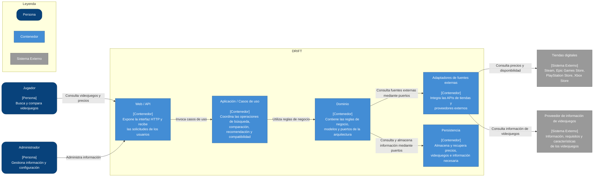

# C4 — Diagrama de Contenedores de DRIFT

El diagrama de contenedores representa la descomposición interna del sistema DRIFT. Cada contenedor representa una unidad principal de ejecución o responsabilidad dentro del sistema y muestra cómo se relaciona con los actores y sistemas externos definidos en el diagrama de contexto.

## Contenedores

| Contenedor                          | Responsabilidad                                                                                          | Relación principal                        |
| ----------------------------------- | -------------------------------------------------------------------------------------------------------- | ----------------------------------------- |
| **Web / API**                       | Recibe las solicitudes HTTP del jugador o administrador y las transforma en llamadas a los casos de uso. | Jugador → Web/API                         |
| **Aplicación / Casos de uso**       | Coordina las operaciones principales de DRIFT: búsqueda, comparación, recomendación y compatibilidad.    | Web/API → Aplicación                      |
| **Dominio**                         | Contiene las reglas de negocio, modelos y puertos de la arquitectura hexagonal.                          | Aplicación → Dominio                      |
| **Adaptadores de fuentes externas** | Implementa la integración con las diferentes tiendas y proveedores de información.                       | Dominio → Adaptadores → Sistemas externos |
| **Persistencia**                    | Gestiona el almacenamiento y recuperación de información necesaria para el sistema.                      | Dominio → Persistencia                    |

## Relaciones principales

* El **Jugador** realiza consultas mediante el contenedor **Web/API**.
* El **Web/API** invoca los casos de uso definidos en **Aplicación**.
* **Aplicación** utiliza las reglas de negocio contenidas en **Dominio**.
* **Dominio** permanece independiente de las tecnologías externas mediante puertos.
* Los **Adaptadores de fuentes externas** implementan la comunicación con las tiendas digitales y proveedores de información.
* **Persistencia** implementa el puerto utilizado por el dominio para almacenar y recuperar información.
* Las tiendas digitales y proveedores externos permanecen fuera del límite de DRIFT.

## Coherencia con la arquitectura

La descomposición corresponde a la Arquitectura Hexagonal seleccionada en el ADR-0001. El dominio se mantiene aislado de los detalles de infraestructura y las integraciones externas se realizan mediante adaptadores.

Esta separación permite incorporar nuevas fuentes externas sin modificar directamente las reglas de negocio, contribuyendo al atributo de calidad prioritario de **mantenibilidad**.

El nivel 2 no descompone todavía los servicios internos de búsqueda, recomendación y compatibilidad. Estos corresponden a una vista de mayor detalle que puede documentarse posteriormente como nivel 3.

