# C4 — Diagrama de Contenedores de DRIFT

El diagrama de contenedores representa la descomposición interna del sistema DRIFT. Cada contenedor representa una unidad principal de ejecución o responsabilidad dentro del sistema y muestra cómo se relaciona con los actores y sistemas externos definidos en el diagrama de contexto.

```mermaid
flowchart LR

    %% =========================
    %% ACTORES Y SISTEMAS EXTERNOS
    %% =========================

    USER["👤 Usuario / Jugador<br/><br/>Consulta videojuegos,<br/>precios y ofertas"]

    STEAM["🎮 Steam API<br/><br/>Proporciona información<br/>y precios de videojuegos"]

    %% =========================
    %% SISTEMA DRIFT
    %% =========================

    subgraph DRIFT["🟦 SISTEMA DRIFT"]

        %% -------------------------
        %% ADAPTADORES DE ENTRADA
        %% -------------------------

        subgraph INPUT["⬅️ ADAPTADORES DE ENTRADA"]

            WEB["🌐 Frontend Web — Next.js<br/><br/>Interfaz que permite al usuario<br/>buscar videojuegos y consultar<br/>su información y precios"]

            API["🔌 API REST — FastAPI<br/><br/>Recibe las solicitudes HTTP,<br/>valida los parámetros y conecta<br/>la interfaz con los casos de uso"]

        end

        %% -------------------------
        %% NÚCLEO HEXAGONAL
        %% -------------------------

        subgraph CORE["NÚCLEO HEXAGONAL"]

            APP["⚙️ Casos de uso<br/><br/>Ejecuta la lógica de aplicación<br/>para buscar videojuegos y coordinar<br/>el acceso a los repositorios"]

            DOMAIN["🧠 Dominio — Game<br/><br/>Representa el videojuego y contiene<br/>los datos principales del negocio,<br/>como identificador, nombre y precios"]

            PORT["🔗 Puerto — GameRepository<br/><br/>Define la interfaz que permite<br/>consultar videojuegos sin depender<br/>de una implementación específica"]

        end

        %% -------------------------
        %% ADAPTADORES DE SALIDA
        %% -------------------------

        subgraph OUTPUT["➡️ ADAPTADORES DE SALIDA"]

            STEAM_ADAPTER["🎮 Adaptador Steam<br/><br/>Implementa GameRepository y traduce<br/>las solicitudes de DRIFT a llamadas<br/>hacia la API externa de Steam"]

            PERSIST["💾 Adaptador de Persistencia<br/><br/>Implementa GameRepository y se encarga<br/>de guardar y recuperar la información<br/>desde el sistema de almacenamiento"]

        end

        %% -------------------------
        %% BASE DE DATOS
        %% -------------------------

        DB[("🗄️ Base de datos DRIFT<br/><br/>Almacena de forma persistente<br/>videojuegos, precios y demás<br/>información necesaria del sistema")]

    end

    %% =========================
    %% FLUJO DE ENTRADA
    %% =========================

    USER -->|"1. Realiza una búsqueda"| WEB

    WEB -->|"2. Solicitud HTTP / REST"| API

    API -->|"3. Ejecuta el caso de uso"| APP

    %% =========================
    %% NÚCLEO
    %% =========================

    APP -->|"4. Utiliza las entidades"| DOMAIN

    APP -->|"5. Solicita datos mediante el puerto"| PORT

    %% =========================
    %% PUERTOS Y ADAPTADORES
    %% =========================

    PORT -.->|"Implementación del puerto"| STEAM_ADAPTER

    PORT -.->|"Implementación del puerto"| PERSIST

    %% =========================
    %% STEAM
    %% =========================

    STEAM_ADAPTER -->|"6. Consulta mediante HTTPS / API"| STEAM

    %% =========================
    %% BASE DE DATOS
    %% =========================

    PERSIST -->|"7. Guarda y consulta datos"| DB

    %% =========================
    %% ESTILOS
    %% =========================

    classDef actor fill:#ffffff,stroke:#333333,stroke-width:2px
    classDef core fill:#e8f0fe,stroke:#1a73e8,stroke-width:2px
    classDef adapter fill:#fff3e0,stroke:#f57c00,stroke-width:2px
    classDef database fill:#e8f5e9,stroke:#2e7d32,stroke-width:2px
    classDef external fill:#fce4ec,stroke:#c2185b,stroke-width:2px

    class USER actor
    class APP,DOMAIN,PORT core
    class WEB,API,STEAM_ADAPTER,PERSIST adapter
    class DB database
    class STEAM external
```

## Contenedores

| Contenedor                             | Responsabilidad                                                                                                                                            | Relación principal           |
| -------------------------------------- | ---------------------------------------------------------------------------------------------------------------------------------------------------------- | ---------------------------- |
| **Web / Frontend**                  | Proporciona la interfaz con la que el jugador consulta videojuegos, precios y ofertas. Está desarrollado con Next.js.                                      | Jugador → Web             |
| **API REST / Backend**              | Recibe las solicitudes HTTP, valida los parámetros y comunica la interfaz con los casos de uso de la aplicación. Está desarrollado con FastAPI.            | Web → API                    |
| **Aplicación / Casos de uso**       | Coordina las operaciones principales de DRIFT, como la búsqueda de videojuegos y la consulta de información mediante los puertos definidos por el dominio. | API → Aplicación             |
| **Dominio**                         | Contiene las entidades y reglas principales del negocio, además de los puertos que permiten mantener el núcleo independiente de la infraestructura.        | Aplicación → Dominio         |
| **Adaptadores de fuentes externas** | Implementa la comunicación con servicios externos como Steam y transforma la información externa al modelo utilizado por DRIFT.                            | Puerto → Adaptador → Steam   |
| **Adaptador de persistencia**       | Implementa el puerto de persistencia y se encarga de guardar y recuperar la información del sistema utilizando la base de datos.                           | Puerto → Persistencia → BD   |
| **Base de datos**                  | Almacena de forma persistente la información necesaria para DRIFT, como videojuegos, precios y otros datos del sistema.                                    | Persistencia → Base de datos |

## Relaciones principales

* El **Jugador** realiza consultas mediante el **Frontend Web**.
* El **Frontend Web** envía las solicitudes al **Backend/API REST** mediante HTTP.
* El **Backend/API** ejecuta los **casos de uso** correspondientes.
* Los **casos de uso** utilizan las entidades y puertos definidos en el **dominio**.
* El **dominio** no depende directamente de tecnologías externas; utiliza **puertos** para comunicarse con los adaptadores.
* El **adaptador de Steam** implementa el puerto correspondiente y se comunica con la **Steam API**.
* El **adaptador de persistencia** implementa el puerto de repositorio y se comunica con la **base de datos**.
* La **base de datos** se encuentra dentro del límite del sistema DRIFT y representa el mecanismo de almacenamiento persistente.
* Los servicios externos, como **Steam**, permanecen fuera del límite de DRIFT.

## Coherencia con la arquitectura

Los adaptadores permiten que el núcleo de DRIFT no dependa directamente de una tecnología específica. Por ejemplo, el caso de uso de búsqueda trabaja con el puerto `GameRepository`, mientras que diferentes adaptadores pueden implementar dicho puerto para consultar Steam o almacenar información en una base de datos.

Esta separación facilita reemplazar o agregar nuevas fuentes de información y mecanismos de persistencia sin modificar directamente las reglas principales del negocio, contribuyendo al atributo de calidad prioritario de **mantenibilidad**.

## Relación con el nivel 3

El **C4 nivel 2** presenta los principales contenedores que forman DRIFT y sus relaciones. El **C4 nivel 3** realiza un mayor nivel de detalle sobre el Backend/API, mostrando componentes como `SearchGames`, `Game`, `GameRepository`, `SteamGameRepository` y el adaptador de persistencia.

## Relaciones principales

* El **Jugador** realiza consultas mediante el contenedor **Web/API**.
* El **Web/API** invoca los casos de uso definidos en **Aplicación**.
* **Aplicación** utiliza las reglas de negocio contenidas en **Dominio**.
* **Dominio** permanece independiente de las tecnologías externas mediante puertos.
* Los **Adaptadores de fuentes externas** implementan la comunicación con las tiendas digitales y proveedores de información.
* **Persistencia** implementa el puerto utilizado por el dominio para almacenar y recuperar información.
* Las tiendas digitales y proveedores externos permanecen fuera del límite de DRIFT.

