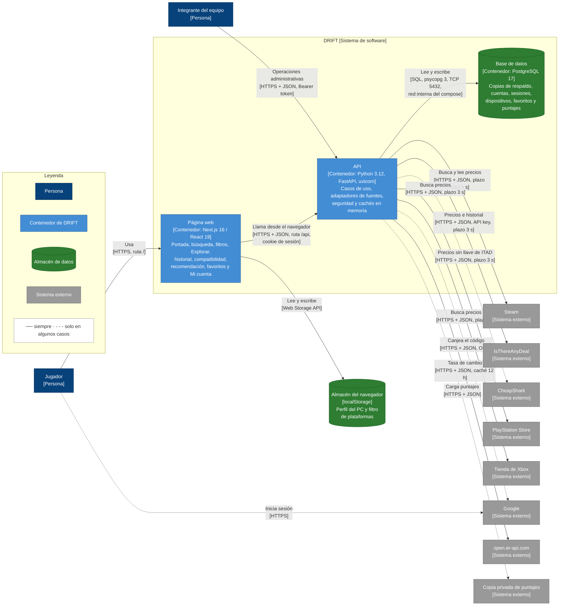

# C4 — Nivel 2: diagrama de contenedores de DRIFT

> **Qué vista usar.** La [«Vista vigente»](#vista-vigente) describe el sistema que está en `master`. La [«Vista histórica»](#vista-histórica-anterior-a-octubre-de-2026-no-describe-el-sistema-actual), al final, se conserva solo como registro de la intención inicial y **no debe usarse** para razonar sobre el sistema.

## Vista vigente

Revisada el 22 de noviembre de 2026 contra `master` en `6bbf83e` (incluye el PR #66) y contra [`deploy/compose.lab.yaml`](../../deploy/compose.lab.yaml). Incluye las decisiones de [ADR-0014](../adr/0014-postgresql-como-persistencia.md) a [ADR-0024](../adr/0024-precios-de-colombia-y-de-referencia.md).

DRIFT tiene **tres contenedores propios**, que se despliegan juntos con Docker Compose en el servidor del laboratorio: la página web, la API y la base de datos. A ellos se suma el almacén del navegador del usuario, que DRIFT usa pero no ejecuta. No hay colas, brokers ni microservicios: toda la comunicación es síncrona (ADR-0008).

```mermaid
flowchart LR
    USER["Jugador<br/>[Persona]"]
    ADMIN["Integrante del equipo<br/>[Persona]"]

    subgraph DRIFT["DRIFT [Sistema de software]"]
        WEB["Página web<br/>[Contenedor: Next.js 16 / React 19]<br/>Portada, búsqueda, filtros, Explorar,<br/>historial, compatibilidad,<br/>recomendación, favoritos y Mi cuenta"]
        API["API<br/>[Contenedor: Python 3.12, FastAPI, uvicorn]<br/>Casos de uso, adaptadores de fuentes,<br/>seguridad y cachés en memoria"]
        DB[("Base de datos<br/>[Contenedor: PostgreSQL 17]<br/>Copias de respaldo, cuentas, sesiones,<br/>dispositivos, favoritos y puntajes")]
    end

    LOCAL[("Almacén del navegador<br/>[localStorage]<br/>Perfil del PC y filtro<br/>de plataformas")]

    STEAM["Steam<br/>[Sistema externo]"]
    ITAD["IsThereAnyDeal<br/>[Sistema externo]"]
    CHEAP["CheapShark<br/>[Sistema externo]"]
    PSN["PlayStation Store<br/>[Sistema externo]"]
    XBOX["Tienda de Xbox<br/>[Sistema externo]"]
    GOOGLE["Google<br/>[Sistema externo]"]
    FX["open.er-api.com<br/>[Sistema externo]"]
    COPY["Copia privada de puntajes<br/>[Sistema externo]"]

    USER -->|"Usa<br/>[HTTPS, ruta /]"| WEB
    WEB -->|"Lee y escribe<br/>[Web Storage API]"| LOCAL
    WEB -->|"Llama desde el navegador<br/>[HTTPS + JSON, ruta /api,<br/>cookie de sesión]"| API
    ADMIN -->|"Operaciones administrativas<br/>[HTTPS + JSON, Bearer token]"| API
    API -->|"Lee y escribe<br/>[SQL, psycopg 3, TCP 5432,<br/>red interna del compose]"| DB

    API -->|"Busca y lee precios<br/>[HTTPS + JSON, plazo total 4 s]"| STEAM
    API -->|"Precios e historial<br/>[HTTPS + JSON, API key, plazo 3 s]"| ITAD
    API -.->|"Precios sin llave de ITAD<br/>[HTTPS + JSON, plazo 3 s]"| CHEAP
    API -->|"Busca precios<br/>[HTTPS + JSON, plazo 3 s]"| PSN
    API -->|"Busca precios<br/>[HTTPS + JSON, plazo 3 s]"| XBOX
    API -.->|"Canjea el código<br/>[HTTPS + JSON, OIDC]"| GOOGLE
    USER -.->|"Inicia sesión<br/>[HTTPS]"| GOOGLE
    API -->|"Tasa de cambio<br/>[HTTPS + JSON, caché 12 h]"| FX
    API -.->|"Carga puntajes<br/>[HTTPS + JSON]"| COPY

    subgraph LEYENDA["Leyenda"]
        direction LR
        K1["Persona"]
        K2["Contenedor de DRIFT"]
        K3[("Almacén de datos")]
        K4["Sistema externo"]
        K5["── siempre · - - - solo en algunos casos"]
    end

    classDef own fill:#438dd5,stroke:#2e6295,color:#ffffff
    classDef store fill:#2e7d32,stroke:#1b5e20,color:#ffffff
    classDef person fill:#08427b,stroke:#052e56,color:#ffffff
    classDef external fill:#999999,stroke:#6b6b6b,color:#ffffff
    classDef note fill:#ffffff,stroke:#999999,color:#333333

    class WEB,API,K2 own
    class DB,LOCAL,K3 store
    class USER,ADMIN,K1 person
    class STEAM,ITAD,CHEAP,PSN,XBOX,GOOGLE,FX,COPY,K4 external
    class K5 note
```

Todas las flechas hacia sistemas externos salen de la API y son HTTPS con JSON. El navegador del usuario descarga la página web y después llama directamente a la API (`NEXT_PUBLIC_DRIFT_API_URL=/api`): la página web no reenvía peticiones a la API desde su servidor. En el laboratorio, Traefik (infraestructura de Dokploy, no un contenedor de DRIFT) publica `https://drift.iscoutb.dev/` hacia la página web y `/api` hacia la API, quitando el prefijo; ver [arc42 §7](../arc42/arc42_7_vista_despliegue.md).

### Contenedores

| Contenedor | Tecnología | Responsabilidad | Qué guarda | Código |
|---|---|---|---|---|
| **Página web** | Next.js 16 (React 19), Node 22; 192 MB, 0,5 CPU | Interfaz: portada con los más vendidos, búsqueda, filtro por plataforma, página «Explorar» por género, detalle con precios e historial, compatibilidad, recomendación, tiendas, favoritos y «Mi cuenta». Organizada en dominio, aplicación, infraestructura e interfaz. | Nada en el servidor. | `frontend/` |
| **API** | Python 3.12, FastAPI 0.162, uvicorn, httpx, psycopg 3; 1 proceso, 192 MB, 0,5 CPU | Expone las 24 rutas HTTP del [contrato OpenAPI](../api/drift/openapi.yaml), ejecuta los casos de uso y habla con todas las fuentes externas mediante adaptadores. Aplica el límite de tasa, el token administrativo, CORS y la sesión. | En memoria: cachés de 60 s por fuente, catálogo de PlayStation, métricas y un segundo respaldo de las copias. Se pierde al reiniciar. | `backend/app/` |
| **Base de datos** | PostgreSQL 17 (alpine); 96 MB, 0,25 CPU; volumen `drift_pgdata` | Lo que debe sobrevivir a un reinicio. Solo la API la alcanza, por la red interna del compose; no se publica en Traefik. | Tablas `source_snapshot` (copias de respaldo, 72 h), `app_user`, `user_session`, `user_device`, `user_favorite`, `hardware_benchmark_set` y `hardware_benchmark`; migraciones en `schema_migrations`. | `backend/app/infrastructure/persistence/postgres_*.py` |
| **Almacén del navegador** | `localStorage` | Lo que el usuario conserva en su propio navegador, con o sin sesión. | Perfil del PC (`drift.pcProfile`) y plataformas elegidas (`drift.platformFilter`). | `frontend/infrastructure/storage/` |

### Qué pasa cuando algo falla

| Falla | Comportamiento | Decisión | Prueba |
|---|---|---|---|
| Una fuente de precios no responde o se queda sin cuota | La búsqueda responde con su última copia (hasta 72 h) y lo avisa en `cached_sources`. Sin copia, la fuente va a `unavailable_sources`. | ADR-0008, ADR-0015 | `test_copia_de_respaldo.py`, `test_source_degradation.py` |
| Steam falla del todo | Se responde con el catálogo local de respaldo y el resto de fuentes. | ADR-0009, ADR-0013 | `test_steam_resilience.py`, `test_s12_plazo_total.py` |
| La base de datos no responde | La búsqueda sigue con las copias en memoria; los puntajes se leen de su copia JSON. Las cuentas y los dispositivos responden 503. | ADR-0014, ADR-0017, ADR-0018 | `test_postgres_snapshot_store.py`, `test_puntajes_en_base_de_datos.py`, `test_cuentas.py` |
| Google no responde | Nadie puede iniciar sesión; quien ya tiene sesión no se ve afectado. | ADR-0017 | `test_cuentas.py` |
| Falta la llave de IsThereAnyDeal | Las tiendas de PC salen de CheapShark y no hay historial. | ADR-0016 | `test_isthereanydeal.py`, `test_cheapshark.py` |

### Aspectos transversales

| Aspecto | Estado real |
|---|---|
| Modelo de ejecución | Síncrono. En cada búsqueda las cuatro fuentes se consultan a la vez, con hilos; no hay cola ni planificador. |
| Sesión | Cookie `drift_session` `HttpOnly`, `SameSite=Lax` y, por HTTPS, `Secure`; en la base solo se guarda la huella SHA-256 del identificador. |
| Configuración y secretos | Variables de entorno en Dokploy: contraseña de la base, llave de IsThereAnyDeal, secreto del cliente de Google, token administrativo y direcciones de la copia de puntajes. Plantilla en `deploy/.env.example`. |
| Despliegue | Servidor del laboratorio (`https://drift.iscoutb.dev`): Docker Compose en Dokploy, 3 contenedores, 480 MB de 512 MB. Azure App Service y Vercel se retiraron el 13 de noviembre de 2026 ([ADR-0022](../adr/0022-desplegar-solo-en-el-laboratorio.md)). |

### Lo que esta vista no comprueba

Esta vista se contrastó con el código y con `deploy/compose.lab.yaml`, no con el servidor en ejecución. Para atar el servidor a un commit, `GET /api/health` devuelve `code_fingerprint` y `scripts/verificar_despliegue.py` la compara con la del código local. El equipo tiene pendiente registrar en [verificaciones pendientes](../evidencias/verificaciones-pendientes-google-y-laboratorio.md) que el contenedor de PostgreSQL arranca en el laboratorio dentro de 96 MB con el volumen con nombre, y el inicio de sesión con Google en el dominio institucional. Hasta entonces, el arranque de la base solo está probado en un equipo de desarrollo (PostgreSQL 16.2) y en el CI (PostgreSQL 17 de servicio).

---

## Vista histórica (anterior a octubre de 2026): no describe el sistema actual

> **Estado: histórica.** Se elaboró al inicio del diseño, antes de ADR-0008 (11 de octubre de 2026), con el propósito de mostrar la descomposición prevista del sistema por responsabilidades. **No describe el sistema actual y mezcla niveles:** coloca en un mismo diagrama contenedores (frontend, API), capas internas del backend (aplicación, dominio, adaptadores) y una «Base de datos» que en esa fecha **no existía** (en octubre el almacenamiento era memoria del proceso, ADR-0008; la base de datos llegó en noviembre con ADR-0014 y es otra: guarda copias de respaldo y cuentas, no el catálogo). Se conserva porque documenta la intención original; para el estado real, ver la vista vigente y el [nivel 3](componentes.md).

El diagrama de contenedores representa la descomposición interna del sistema DRIFT. Cada contenedor representa una unidad principal de ejecución o responsabilidad dentro del sistema y muestra cómo se relaciona con los actores y sistemas externos definidos en el diagrama de contexto.

```mermaid
flowchart LR

    %% =========================
    %% ACTORES Y SISTEMAS EXTERNOS
    %% =========================

    USER["👤 Usuario / Jugador<br/><br/>Consulta videojuegos,<br/>precios y ofertas"]

    STEAM["🎮 Steam API<br/><br/>Proporciona información<br/>y precios de videojuegos"]

    PLAYSTATION["🎮 PlayStation API<br/><br/>Proporciona información<br/>y catálogo de videojuegos"]

    %% =========================
    %% SISTEMA DRIFT
    %% =========================

    subgraph DRIFT["🟦 SISTEMA DRIFT"]

        %% -------------------------
        %% ADAPTADORES DE ENTRADA
        %% -------------------------

        subgraph INPUT["⬅️ ADAPTADORES DE ENTRADA"]

            WEB["🌐 Frontend Web — Next.js<br/><br/>Interfaz que permite al usuario<br/>buscar videojuegos y consultar<br/>su información y precios"]

            API["🔌 API REST — FastAPI<br/><br/>Recibe las solicitudes HTTP,<br/>valida los parámetros y conecta<br/>la interfaz con los casos de uso"]

        end

        %% -------------------------
        %% NÚCLEO HEXAGONAL
        %% -------------------------

        subgraph CORE["NÚCLEO HEXAGONAL"]

            APP["⚙️ Casos de uso<br/><br/>Ejecuta la lógica de aplicación<br/>para buscar videojuegos y coordinar<br/>el acceso a los repositorios"]

            DOMAIN["🧠 Dominio — Game<br/><br/>Representa el videojuego y contiene<br/>los datos principales del negocio,<br/>como identificador, nombre y precios"]

            PORT["🔗 Puerto — GameRepository<br/><br/>Define la interfaz que permite<br/>consultar videojuegos sin depender<br/>de una implementación específica"]

        end

        %% -------------------------
        %% ADAPTADORES DE SALIDA
        %% -------------------------

        subgraph OUTPUT["➡️ ADAPTADORES DE SALIDA"]

            STEAM_ADAPTER["🎮 Adaptador Steam<br/><br/>Implementa GameRepository y traduce<br/>las solicitudes de DRIFT a llamadas<br/>hacia la API externa de Steam"]

            PLAYSTATION_ADAPTER["🎮 Adaptador PlayStation<br/><br/>Gestiona la integración con PlayStation<br/>y transforma la información externa<br/>al modelo utilizado por DRIFT"]

            PERSIST["💾 Adaptador de Persistencia<br/><br/>Implementa GameRepository y se encarga<br/>de guardar y recuperar la información<br/>desde el sistema de almacenamiento"]

        end

        %% -------------------------
        %% BASE DE DATOS
        %% -------------------------

        DB[("🗄️ Base de datos DRIFT<br/><br/>Almacena de forma persistente<br/>videojuegos, precios y demás<br/>información necesaria del sistema")]

    end

    %% =========================
    %% FLUJO DE ENTRADA
    %% =========================

    USER -->|"1. HTTPS + interacción web"| WEB

    WEB -->|"2. HTTP/REST + JSON"| API

    API -->|"3. Invocación de caso de uso"| APP

    %% =========================
    %% NÚCLEO
    %% =========================

    APP -->|"4. Acceso a entidades y reglas de dominio"| DOMAIN

    APP -->|"5. Invocación del puerto GameRepository"| PORT

    %% =========================
    %% PUERTOS Y ADAPTADORES
    %% =========================

    PORT -.->|"Implementación del puerto"| STEAM_ADAPTER

    PORT -.->|"Implementación del puerto"| PLAYSTATION_ADAPTER

    PORT -.->|"Implementación del puerto"| PERSIST

    %% =========================
    %% FUENTES EXTERNAS
    %% =========================

    STEAM_ADAPTER -->|"6. HTTP/REST + JSON"| STEAM

    PLAYSTATION_ADAPTER -->|"7. HTTP/REST + JSON"| PLAYSTATION

    %% =========================
    %% BASE DE DATOS
    %% =========================

    PERSIST -->|"8. Persistencia de datos"| DB

    %% =========================
    %% ESTILOS
    %% =========================

    classDef actor fill:#ffffff,stroke:#333333,stroke-width:2px,color:#000000
    classDef core fill:#e8f0fe,stroke:#1a73e8,stroke-width:2px,color:#000000
    classDef adapter fill:#fff3e0,stroke:#f57c00,stroke-width:2px,color:#000000
    classDef database fill:#e8f5e9,stroke:#2e7d32,stroke-width:2px,color:#000000
    classDef external fill:#fce4ec,stroke:#c2185b,stroke-width:2px,color:#000000

    class USER actor
    class APP,DOMAIN,PORT core
    class WEB,API,STEAM_ADAPTER,PLAYSTATION_ADAPTER,PERSIST adapter
    class DB database
    class STEAM,PLAYSTATION external

```

### Contenedores (histórico)

| Contenedor                          | Responsabilidad                                                                                                                                                                                                                                                | Relación principal                                   |
| ----------------------------------- | -------------------------------------------------------------------------------------------------------------------------------------------------------------------------------------------------------------------------------------------------------------- | ---------------------------------------------------- |
| **Web / Frontend**                  | Proporciona la interfaz con la que el jugador consulta videojuegos, precios y ofertas. Está desarrollado con Next.js.                                                                                                                                          | Jugador → Web                                        |
| **API REST / Backend**              | Recibe las solicitudes HTTP, valida los parámetros y comunica la interfaz con los casos de uso de la aplicación. Está desarrollado con FastAPI.                                                                                                                | Web → API mediante HTTP/REST + JSON                  |
| **Aplicación / Casos de uso**       | Coordina las operaciones principales de DRIFT, como la búsqueda de videojuegos y la consulta de información mediante los puertos definidos por el dominio.                                                                                                     | API → Aplicación                                     |
| **Dominio**                   | Contiene las entidades y reglas principales del negocio, además de los puertos que permiten mantener el núcleo independiente de la infraestructura.                                                                                                            | Aplicación → Dominio                                       |
| **Adaptador de Steam**        | Implementa `GameRepository`, gestiona la comunicación con Steam y transforma la información externa al modelo utilizado por DRIFT.                                                                                                                             | Puerto → Adaptador → Steam mediante HTTP/REST + JSON       |
| **Adaptador de PlayStation**  | Gestiona la integración con la API de PlayStation y transforma la información externa al modelo utilizado por DRIFT.                                                                                                                                           | Puerto → Adaptador → PlayStation mediante HTTP/REST + JSON |
| **Adaptador de persistencia** | Implementa el puerto de persistencia y proporciona el mecanismo para guardar y recuperar la información del sistema. Actualmente se dispone de un repositorio en memoria y se contempla la integración con la base de datos como evolución de la arquitectura. | Puerto → Persistencia → Base de datos                        |
| **Base de datos**                   | Representa el mecanismo de almacenamiento persistente previsto para DRIFT, destinado a conservar videojuegos, precios y demás información necesaria del sistema.                                                                                               | Persistencia → Base de datos                         |

### Relaciones principales (histórico)

* El **Jugador** realiza consultas mediante el **Frontend Web** utilizando la interfaz web.
* El **Frontend Web** envía las solicitudes al **Backend/API REST** mediante HTTP/REST + JSON.
* El **Backend/API REST** valida las solicitudes y ejecuta los casos de uso correspondientes.
* Los **casos de uso** utilizan las entidades y puertos definidos en el **dominio**.
* El **dominio** no depende directamente de tecnologías externas; utiliza **puertos** para comunicarse con los adaptadores.
* El **puerto GameRepository** es implementado por los adaptadores que proporcionan las diferentes estrategias de acceso a los datos.
* El **adaptador de Steam** implementa el puerto correspondiente y se comunica con la **Steam API** mediante HTTP/REST + JSON.
* El **adaptador de persistencia** implementa el puerto de repositorio y se comunica con la **base de datos**.
* La **base de datos** se encuentra dentro del límite del sistema DRIFT y representa el mecanismo de almacenamiento persistente  previsto para la evolución de la arquitectura.
* Actualmente, el proyecto cuenta con un mecanismo de persistencia en memoria, mientras que la integración con una base de datos constituye parte de la arquitectura prevista.
* Los servicios externos, como **Steam**, permanecen fuera del límite de DRIFT.

### Coherencia con la arquitectura (histórico)

Los adaptadores permiten que el núcleo de DRIFT no dependa directamente de una tecnología específica. Por ejemplo, el caso de uso de búsqueda trabaja con el puerto `GameRepository`, mientras que diferentes adaptadores pueden implementar dicho puerto para consultar Steam o almacenar información en una base de datos.

Esta separación facilita reemplazar o agregar nuevas fuentes de información y mecanismos de persistencia sin modificar directamente las reglas principales del negocio, contribuyendo al atributo de calidad prioritario de **mantenibilidad**.

### Relación con el nivel 3 (histórico)

El **C4 nivel 2** presenta los principales contenedores que forman DRIFT y sus relaciones. El **C4 nivel 3** realiza un mayor nivel de detalle sobre el Backend/API, mostrando componentes como `SearchGames`, `Game`, `GameRepository`, `SteamGameRepository` y el adaptador de persistencia.
