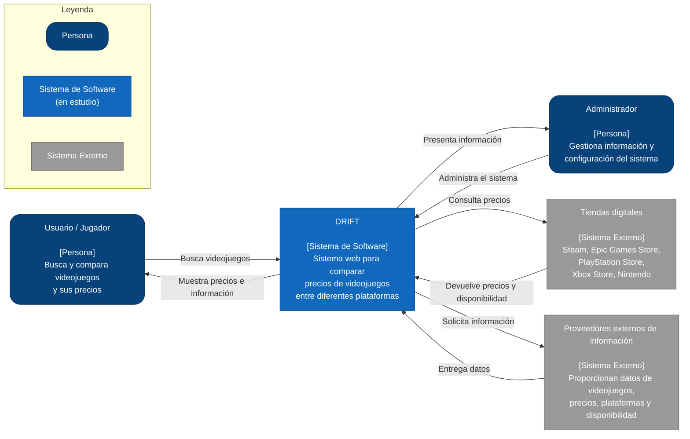

# C4 — Diagrama de Contexto de DRIFT
El diagrama de contexto representa a DRIFT como el sistema principal y muestra
los usuarios y sistemas externos que interactúan con él, permitiendo
identificar de forma clara los límites del sistema y sus relaciones externas.

