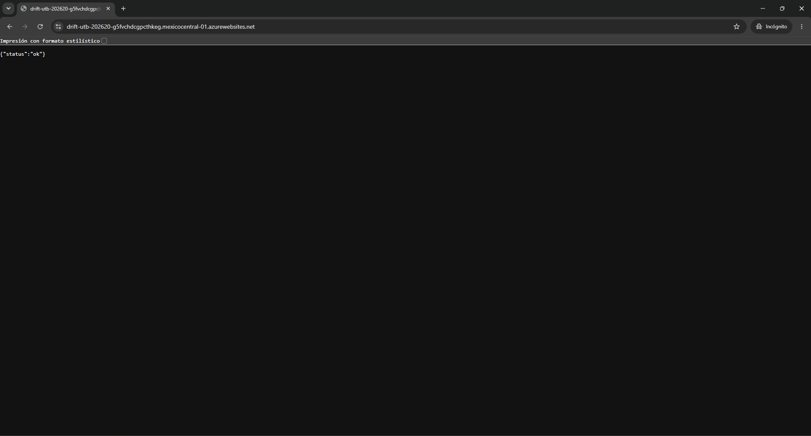
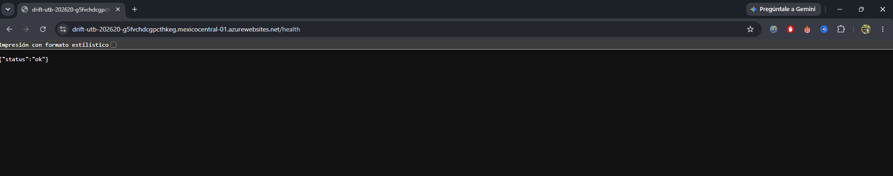

# Evidencia técnica — S8

## 1. URL del sistema accesible desde fuera de la red de la universidad

### Objetivo

Verificar que el backend de DRIFT se encuentra desplegado y accesible públicamente desde Internet, fuera del entorno local de desarrollo y de la red de la universidad.

### Sistema desplegado

El backend de DRIFT se encuentra desplegado en **Azure App Service** y cuenta con la siguiente URL pública:

**URL:**

https://drift-utb-202620-g5fvchdcgpcthkeg.mexicocentral-01.azurewebsites.net

### Resultado de la comprobación

Al acceder a la URL pública desde un navegador se obtuvo una respuesta exitosa:

```json
{
  "status": "ok"
}
```

**Código de respuesta:** HTTP 200 OK

**Fecha de comprobación:** 27/09/2026

**Hora de comprobación:** `[8:20 pm]`

### Evidencia

La siguiente captura muestra el acceso al backend desplegado en Azure desde un navegador:

> **Figura 1. Acceso público al backend de DRIFT desplegado en Azure App Service.**



La respuesta `{"status":"ok"}` confirma que el servicio se encuentra disponible y puede ser consultado mediante su URL pública.

---

## 2. Health check consultable

### Objetivo

Verificar que el sistema cuenta con un endpoint de comprobación de disponibilidad que permita determinar si el backend se encuentra funcionando correctamente.

### Endpoint

El backend expone el siguiente endpoint:

```text
GET /health
```

**URL completa:**

[https://drift-utb-202620-g5fvchdcgpcthkeg.mexicocentral-01.azurewebsites.net/health](https://drift-utb-202620-g5fvchdcgpcthkeg.mexicocentral-01.azurewebsites.net/health)

### Resultado de la comprobación

La solicitud al endpoint `/health` produjo la siguiente respuesta:

```json
{
  "status": "ok"
}
```

**Código de respuesta:** HTTP 200 OK

**Fecha de comprobación:** 27/09/2026

**Hora de comprobación:** `[8:30 pm]`

### Evidencia

> **Figura 2. Health check del backend mediante el endpoint `/health`.**



La respuesta HTTP 200 y el contenido `{"status":"ok"}` permiten comprobar que el backend se encuentra disponible y respondiendo correctamente.

---

## 3. Infraestructura como código versionada en el repositorio

### Objetivo

Demostrar que la infraestructura utilizada para desplegar el backend de DRIFT se encuentra definida como código y versionada dentro del repositorio del proyecto.

### Tecnología utilizada

La infraestructura de Azure se define mediante **Azure Bicep**.

Los archivos se encuentran dentro de la siguiente ruta del repositorio:

```text
infra/azure/
```

La estructura relevante es:

```text
infra/
└── azure/
    ├── main.bicep
    ├── main.parameters.json
    └── README.md
```

### Archivo principal de infraestructura

El archivo:

```text
infra/azure/main.bicep
```

contiene la definición de los recursos de Azure utilizados por el backend.

Entre los recursos y configuraciones definidos se encuentran:

* Azure App Service Plan.
* Sistema operativo Linux.
* SKU F1 (Free).
* Región `mexicocentral`.
* Azure App Service para el backend.
* Python 3.12.
* HTTPS obligatorio.
* FTPS únicamente.
* TLS mínimo 1.2.
* Configuración de CORS.
* Comando de inicio `bash startup.sh`.

El archivo Bicep define, entre otros, el App Service Plan y el recurso del backend:

```text
Microsoft.Web/serverfarms
Microsoft.Web/sites
```

### Archivo de parámetros

Los valores utilizados para el despliegue se encuentran separados en:

```text
infra/azure/main.parameters.json
```

Este archivo contiene parámetros como:

```text
location = mexicocentral
appServicePlanName = ASP-rgdriftas202620-8b10
appName = drift-utb-202620
```

También contiene los orígenes permitidos para CORS.

### Documentación de la infraestructura

La carpeta también contiene:

```text
infra/azure/README.md
```

Este archivo documenta los recursos definidos y explica cómo reproducir el despliegue mediante Azure CLI.

El despliegue puede reproducirse mediante:

```powershell
az deployment group create `
  --resource-group rg-drift-as202620 `
  --template-file infra/azure/main.bicep `
  --parameters @infra/azure/main.parameters.json
```

### Evidencia en el repositorio

La infraestructura se encuentra versionada en GitHub dentro del repositorio:

**Repositorio:**

[https://github.com/ISCOUTB/AS_202620_Drift](https://github.com/ISCOUTB/AS_202620_Drift)

**Archivos de infraestructura:**

* `infra/azure/main.bicep`
* `infra/azure/main.parameters.json`
* `infra/azure/README.md`
---

## 4. Enlaces de verificación

### Sistema desplegado

[https://drift-utb-202620-g5fvchdcgpcthkeg.mexicocentral-01.azurewebsites.net](https://drift-utb-202620-g5fvchdcgpcthkeg.mexicocentral-01.azurewebsites.net)

### Health check

[https://drift-utb-202620-g5fvchdcgpcthkeg.mexicocentral-01.azurewebsites.net/health](https://drift-utb-202620-g5fvchdcgpcthkeg.mexicocentral-01.azurewebsites.net/health)

### Métricas

[https://drift-utb-202620-g5fvchdcgpcthkeg.mexicocentral-01.azurewebsites.net/metrics](https://drift-utb-202620-g5fvchdcgpcthkeg.mexicocentral-01.azurewebsites.net/metrics)

### Repositorio

[https://github.com/ISCOUTB/AS_202620_Drift](https://github.com/ISCOUTB/AS_202620_Drift)

### Infraestructura Bicep

[https://github.com/ISCOUTB/AS_202620_Drift/blob/master/infra/azure/main.bicep](https://github.com/ISCOUTB/AS_202620_Drift/blob/master/infra/azure/main.bicep)

### Parámetros de infraestructura

[https://github.com/ISCOUTB/AS_202620_Drift/blob/master/infra/azure/main.parameters.json](https://github.com/ISCOUTB/AS_202620_Drift/blob/master/infra/azure/main.parameters.json)

### Documentación de infraestructura

[https://github.com/ISCOUTB/AS_202620_Drift/blob/master/infra/azure/README.md](https://github.com/ISCOUTB/AS_202620_Drift/blob/master/infra/azure/README.md)
